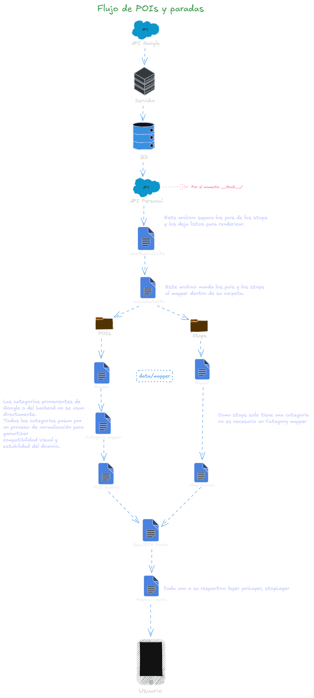

# POIs (Points of Interest)

El módulo de POIs está diseñado para crecer sin romperse cuando:

- Aumenten los POIs (cientos o miles).
- Se agreguen nuevas categorías.
- Se integren múltiples ciudades.
- Se conecte un backend real.

---

## Objetivos del módulo

- ✅ Mantener una **arquitectura escalable**.
- ✅ Separar **datos, mapeo y dominio**.
- ✅ Facilitar la integración con **API backend**.
- ✅ Evitar que el mapa se rompa cuando crezcan los datos.
- ✅ Permitir que frontend y backend trabajen en paralelo.

---

## Concepto clave

> **El mapa es solo una vista.**  
> **Los POIs son datos.**  
> **Nunca se mezclan.**

Esto significa que los POIs:

- ❌ NO se crean directamente en el mapa.
- ❌ NO se renderizan manualmente uno por uno.
- ❌ NO dependen del estilo del mapa.
- ❌ NO conocen ciudades, backend ni API.

Todo el sistema pasa por **capas bien definidas**.

---

## Estructura de carpetas

```txt
src/map/pois/
  ├─ api/
  │   └─ poi.api.ts
  ├─ data/
  │   ├─ poi.data.ts
  │   ├─ poi.mapper.ts
  │   └─ poiCategory.mapper.ts
  ├─ repository/
  │   └─ pois.repository.ts
  ├─ services/
  │   └─ poi.service.ts
  ├─ styles/
  │   └─ poi.styles.ts
  └─ types/
      ├─ poi.dto.ts
      └─ poi.types.ts
```

Además, existe un mock genérico del mapa:

```txt
src/map/__mock__/
  └─ mapEntities.mock.ts
```

---

## Responsabilidad de cada carpeta

### types/ (CONTRATO DEL SISTEMA)

**Archivos:** `poi.types.ts`, `poi.dto.ts`

- POI y POICategory definen el modelo de dominio que usa el frontend (mapa, listas, hooks).
- POIDTO representa cómo viene un POI desde el backend o fuentes externas.

**IMPORTANTE**

- POI.coordinates es SIEMPRE [longitud, latitud].
- POICategory solo permite categorías soportadas (restaurant, hospital, school, shop, etc.).
- Cualquier cambio en POI o POIDTO debe coordinarse, porque impacta todo el flujo.

---

### api/ (DEFINICIÓN DE ENDPOINTS)

**Archivo:** `poi.api.ts`

- Define las rutas de la API (por ejemplo: /cities/:cityId/pois).
- No hace fetch ni lógica.
- Su único objetivo es centralizar URLs.

```ts
export const POIS_API = {
  byCity: (cityId: string) => `/cities/${cityId}/pois`,
};
```

> Cuando cambie la URL del backend, solo se modifica aquí.

---

### services/ (COMUNICACIÓN CON BACKEND)

**Archivo:** `poi.service.ts`

- Encapsula la comunicación HTTP real con el backend.
- Usará los endpoints definidos en poi.api.ts.
- Devuelve POIDTO[], nunca POI directamente.

> Mientras el backend no exista, este archivo puede permanecer vacío

---

### data/ (MOCK / DATOS TEMPORALES)

Archivo: `poi.data.ts`, `poi.mapper.ts`, `poiCategory.mapper.ts`

**poi.data.ts – Datos de dominio (mock de POI)**

- Contiene un arreglo de POI[] ya normalizados.
- Sirve como fuente local simple cuando no quieres pasar por toda la cadena DTO → dominio.
- Ideal para pruebas rápidas de estilos, zoom, iconos, etc.

**poi.mapper.ts – DTO → Dominio** 
Convierte de POIDTO (lo que viene de API/mocks genéricos) a POI:

- Normaliza coordenadas a [lng, lat].
- Valida y mapea la categoría mediante mapPOICategory.
- Aplica valores por defecto (por ejemplo, importance: "high").

**poiCategory.mapper.ts – Normalización de categorías**

- Recibe una categoría cruda desde el backend ("food", "cafe", "clinic", etc.).
- Devuelve una categoría válida de POICategory.

Reglas:

- Nunca se debe usar dto.category directamente en el mapa.
- Si llega una categoría desconocida:
  - En desarrollo se muestra un console.warn.
  - En producción se usa una categoría segura por defecto ("shop").

  ---

### layers/ (RENDERIZADO EN MAPBOX)

**Archivo:** `POIsLayer.tsx`

Responsabilidades:
- Convertir `POI[]` a un `FeatureCollection` GeoJSON.
- Definir cómo se dibujan los íconos y labels en el mapa.
- Filtrar qué POIs se muestran según:
  - `visibleCategories` (controlado por la UI).
  - `importance` + nivel de zoom (high, medium, low).

Reglas:
-  No hace fetch ni lee datos del backend.
- No contiene datos hardcodeados de POIs.
- No conoce ciudades ni detalles de la API; solo recibe `POI[]` ya procesados.

> El campo `importance` de `POI` controla a qué zoom aparece cada categoría de importancia.  
> La lógica de zoom vive en `POIsLayer.tsx`, no en el dominio.

---

### styles/ (CONFIGURACIÓN VISUAL)

**Archivo:** `poi.styles.ts`

Solo contiene constantes visuales:
- minZoom para mostrar POIs.
- iconSize.
- iconAllowOverlap, etc.

> Permite ajustar diseño sin tocar lógica.

---

### Mock general del mapa

**Archivo:** `src/map/__mock__/mapEntities.mock.ts`

- Contiene una lista de entidades mixtas MapEntityDTO[] (POI y STOP).
- Actualmente es la fuente principal de datos mientras el backend no está listo.
- El pipeline típico es:

```txt
mapEntities.mock.ts (MapEntityDTO[])
   ├─→ filtro por type === "POI"
   └─→ mapPOIDTOToPOI(dto)  →  POI[]
```

> Cuando exista backend, este mock se puede desactivar sin tocar la arquitectura de POIs.

Actualmente el hook de mapa lee `mapEntities.mock.ts`, filtra las entidades con `type === "POI"` y las pasa por `mapPOIDTOToPOI` antes de enviarlas a `POIsLayer`.

---

## Flujo de POIs y paradas

El siguiente diagrama muestra el recorrido completo de los datos:

1. Datos externos (API de Google / backend propio) llegan al servidor y se guardan en BD.
2. El frontend consume una API propia (o mocks) y obtiene entidades mixtas (`MapEntityDTO`).
3. Un hook de mapa separa POIs de paradas y entrega los datos a los mappers de cada dominio.
4. El módulo de POIs:
   - Mapea `POIDTO` → `POI` (`poi.mapper.ts`, `poiCategory.mapper.ts`).
   - Genera estructuras GeoJSON.
   - Envía los datos a `POIsLayer` para que Mapbox los pinte.
5. El usuario ve POIs normalizados, con categorías y estilos consistentes.

Diagrama del flujo:



---

### Iconos de POIs

Los iconos se registran una sola vez en `MapViewBase` usando `Mapbox.Images`.

Regla:
- 1 icono por categoría
- Muchos POIs pueden usar el mismo icono

```ts
<Mapbox.Images
  images={{
    shop: require(".../poi-shop.png"),
    school: require(".../poi-school.png"),
    hospital: require(".../poi-hospital.png"),
    test: require(".../poi-test.png"),
  }}
/>
```

> El nombre del icono DEBE coincidir con `POICategory`.

---

## Reglas de crecimiento del módulo

Agregar un nuevo POI no debe requerir cambios en mappers ni estilos:
- Si usas poi.data.ts, solo agrega un nuevo elemento POI.
- Si usas backend, solo agrega un nuevo registro que cumpla el contrato POIDTO.

Agregar una nueva categoría requiere:
- Actualizar POICategory en `poi.types.ts.`
- Extender POI_CATEGORY_MAP en poiCategory.mapper.ts.
- Registrar su icono en MapViewBase.
- (Opcional) ajustar estilos en poi.styles.ts.

> Si alguna de estas reglas se rompe, la arquitectura debe revisarse.

---

## Modo Offline

- Los POIs se pueden renderizar desde fuentes locales (poi.data.ts o cache) sin depender de la API.
- La API (cuando exista) solo se usará para sincronizar periódicamente.
- Si no hay red, el mapa debe seguir mostrando los POIs más recientes disponibles.


---

- **[Volver al README principal](../../README.md)**