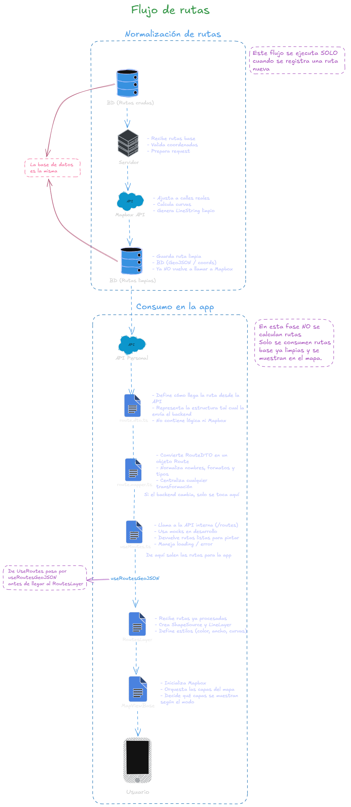

# Routes (Rutas de transporte)

El módulo de Routes se encarga de mostrar rutas ya calculadas y limpias en el mapa, sin recalcular caminos en el frontend.

---

## Objetivos del módulo

- ✅ Mostrar rutas de camión en el mapa de forma clara y performante.
- ✅ Separar el cálculo/normalización de rutas (backend) del consumo en la app.
- ✅ Mantener un modelo de dominio (`Route`) estable, independiente del backend.
- ✅ Permitir cambiar la fuente (mock → API real) sin tocar las capas de Mapbox.

---

## Estructura de carpetas

```txt
src/map/routes/
  ├─ data/
  │   ├─ route.mapper.ts      # RouteDTO -> Route
  │   └─ routes.mock.ts       # Rutas de dominio para desarrollo
  ├─ hooks/
  │   ├─ useRoutes.ts         # Obtiene rutas (hoy: mock)
  │   └─ useRoutesGeoJSON.ts  # Route[] -> GeoJSON (LineString)
  ├─ styles/
  │   └─ route.styles.ts      # Estilos por tipo de ruta
  └─ types/
      ├─ route.dto.ts         # Formato crudo desde backend
      └─ route.types.ts       # Modelo de dominio
```

> En el mapa, las rutas se renderizan desde src/map/layers/routes/RoutesLayers.tsx y se conectan a MapViewBase.

---

## Contratos del dominio (types/)

**route.types.ts – Dominio**

```ts
/**
 * Route (Dominio)
 * --------------------------------
 * Representa una ruta ya procesada
 * y lista para renderizarse en el mapa.
 */
export interface Route {
  /** ID estable de la ruta */
  id: string;

  /**
   * Coordenadas normalizadas (GeoJSON)
   * ⚠️ [lng, lat]
   */
  coordinates: [number, number][];

  /**
   * Tipo de ruta
   * (para estilos y lógica futura)
   */
  type: "SUGGESTED" | "ACTIVE" | "EXPLORER";
}
```

- coordinates está listo para usarse en un LineString.
- type permite aplicar estilos distintos (ruta sugerida, activa, de exploración, etc.).

**route.dto.ts – DTO del backend**

```ts
/**
 * RouteDTO
 * --------------------------------
 * Ruta tal como viene del backend.
 *
 * Backend → Mapper → Dominio
 */
export interface RouteDTO {
  id: string;

  /**
   * Array de puntos en formato backend
   * [lat, lng]
   */
  points: [number, number][];
}
```

- Representa cómo llega la ruta desde el backend.
- El orden de coordenadas es distinto y debe normalizarse.

---

## Estilos de rutas (styles/route.styles.ts)

Define cómo se ve cada tipo de ruta:

```ts
export const ROUTE_STYLES = {
  SUGGESTED: {
    color: "#2563eb",
    width: 4,
    opacity: 0.8,
  },
  ACTIVE: {
    color: "#16a34a",
    width: 5,
    opacity: 1,
  },
};
```

- Se puede extender con EXPLORER o más tipos sin tocar el dominio.
- La capa (RoutesLayer) puede usar estos estilos en lugar de colores hardcodeados.

---

## Mapeo Backend → Dominio (data/route.mapper.ts)

**Responsabilidad:** convertir RouteDTO a Route con coordenadas listas para GeoJSON.

**Puntos clave:**

- El frontend no depende del formato exacto del backend.
- Se invierte [lat, lng] → [lng, lat].
- Se asigna un tipo inicial de ruta ("SUGGESTED" por ahora).

```ts
import { RouteDTO } from "../types/route.dto";
import { Route } from "../types/route.types";

/**
 * mapRouteDTOToRoute
 * --------------------------------
 * Normaliza rutas del backend
 * a formato dominio.
 */
export function mapRouteDTOToRoute(dto: RouteDTO): Route {
  return {
    id: dto.id,

    // conversión crítica
    coordinates: dto.points.map(([lat, lng]) => [lng, lat]),

    // por ahora default
    type: "SUGGESTED",
  };
}
```

## Datos temporales (data/routes.mock.ts)

Mientras no exista backend, se usan rutas de dominio ya normalizadas:

```ts
import { Route } from "../types/route.types";

/**
 * routesMock
 * --------------------------------
 * Rutas simuladas para desarrollo local.
 *
 * ⚠️ Usa el formato de DOMINIO (Route),
 * no DTO, igual que POIs y Stops.
 *
 * Esto garantiza que:
 * - El backend se pueda conectar sin cambios
 * - Las capas de Mapbox no dependan de mocks
 */
export const routesMock: Route[] = [
  {
    id: "route-1",
    type: "SUGGESTED",
    coordinates: [
      [-108.486451, 25.566776],
      [-108.485875, 25.566631],
      [-108.485441, 25.566572],
      [-108.48454, 25.566598],
      [-108.483481, 25.566674],
      [-108.482788, 25.566798],
      [-108.481606, 25.567084],
      [-108.481083, 25.565312],
    ],
  },
];
```

> El mock usa el formato de dominio (Route), no RouteDTO.
> Esto permite conectar el backend en el futuro sin cambiar capas ni hooks.

---

## Hook de obtención de rutas (hooks/useRoutes.ts)

`useRoutes` es el punto de entrada para obtener rutas en la app.

**Hoy:**

- Lee routesMock y las mete en estado local.

**Mañana:**

- Hará fetch("/api/map/routes").
- Aplicará mapRouteDTOToRoute.
- Podrá manejar loading/error.

```ts
import { useEffect, useState } from "react";
import { Route } from "../types/route.types";
import { routesMock } from "../data/routes.mock";

/**
 * useRoutes
 * --------------------------------
 * Hook de obtención de rutas.
 *
 * Hoy:
 * - Usa datos mock
 *
 * Mañana:
 * - fetch("/api/map/routes")
 * - mapRouteDTOToRoute
 */
export function useRoutes() {
  const [routes, setRoutes] = useState<Route[]>([]);

  useEffect(() => {
    // mock temporal
    setRoutes(routesMock);
  }, []);

  return routes;
}
```

---

## Hook de transformación a GeoJSON (hooks/useRoutesGeoJSON.ts)

Convierte Route[] a FeatureCollection<LineString>:

```ts
import { useMemo } from "react";
import { FeatureCollection, LineString } from "geojson";
import { Route } from "../types/route.types";

export function useRoutesGeoJSON(
  routes: Route[],
): FeatureCollection<LineString> {
  return useMemo(
    () => ({
      type: "FeatureCollection",
      features: routes.map((route) => ({
        type: "Feature",
        properties: {
          id: route.id,
          type: route.type,
        },
        geometry: {
          type: "LineString",
          coordinates: route.coordinates,
        },
      })),
    }),
    [routes],
  );
}
```

**Responsabilidades:**

- Mantener la conversión a GeoJSON aislada del render.
- Exponer propiedades (id, type) que la capa puede usar para estilos dinámicos.
- Optimizar con useMemo para evitar recalcular en cada render.

---

## Capa de mapa (RoutesLayer)

RoutesLayer vive en `src/map/layers/routes/RoutesLayers.tsx` y se usa desde MapViewBase.

**Responsabilidad principal:**

> Tomar el GeoJSON de rutas y dibujarlo en el mapa como líneas.

```ts
import Mapbox from "@rnmapbox/maps";
import { Route } from "@/src/map/routes/types/route.types";
import { useRoutesGeoJSON } from "@/src/map/routes/hooks/useRoutesGeoJSON";
import { ROUTE_STYLES } from "@/src/map/routes/styles/route.styles";

interface RoutesLayerProps {
  routes: Route[];
}

export function RoutesLayer({ routes }: RoutesLayerProps) {
  const geojson = useRoutesGeoJSON(routes);

  if (!geojson.features.length) return null;

  return (
    <Mapbox.ShapeSource id="routes-source" shape={geojson}>
      <Mapbox.LineLayer
        id="routes-line"
        belowLayerID="pois-icons"
        style={{
          // TODO: usar ROUTE_STYLES según route.type (cuando se separen layers por tipo)
          lineColor: ROUTE_STYLES.SUGGESTED.color,
          lineWidth: ["interpolate", ["linear"], ["zoom"], 12, 2, 15, 4, 18, 6],
          lineOpacity: ROUTE_STYLES.SUGGESTED.opacity,
        }}
      />
    </Mapbox.ShapeSource>
  );
}
```

- ShapeSource recibe el FeatureCollection generado por useRoutesGeoJSON.
- LineLayer define color, grosor y opacidad.
- belowLayerID="pois-icons" garantiza que las rutas queden bajo los POIs.

---

## Integración con MapViewBase

En MapViewBase, las rutas se conectan así:

```ts
const routes = useRoutes();

{config.showRoutes !== "NONE" && <RoutesLayer routes={routes} />}
```

- useRoutes elige la fuente (mock hoy, backend mañana).
- RoutesLayer se encarga solo de dibujar.
- El modo de mapa (mapMode) decide si se muestran o no las rutas.

---

## Diagrama del flujo de rutas

Este diagrama separa dos fases:
- **Normalización (backend):** se ejecuta solo al registrar/actualizar una ruta; guarda rutas limpias en BD.
- **Consumo (app):** la app solo descarga rutas limpias, las mapea al dominio y las renderiza.



---

- **[Volver al README principal](../../README.md)**
